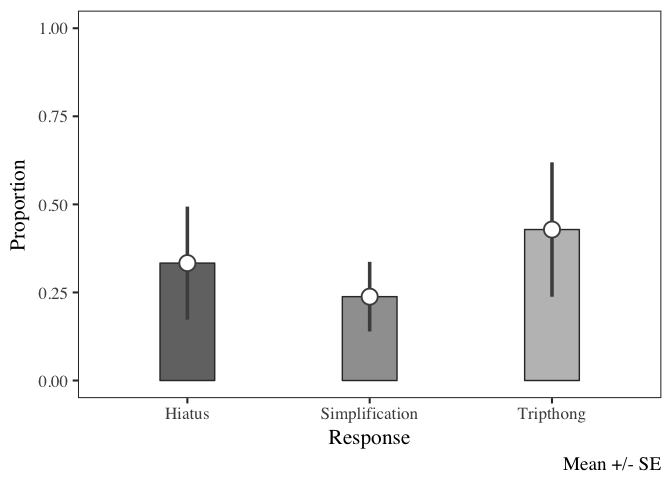

Syllabic affiliation of glides in chicano
=========================================

Last update: 2018-04-27
-----------------------

1.  [data](./data/)
2.  [praatScripts](./praatScripts/)
3.  [rScripts](./rScripts/)
4.  [sources](./sources/)

------------------------------------------------------------------------

Analyses
========

    source("./rScripts/04_exploratory_plots.R")

    ## ── Attaching packages ────────────────────────── tidyverse 1.2.1 ──

    ## ✔ ggplot2 2.2.1.9000     ✔ purrr   0.2.4     
    ## ✔ tibble  1.4.2          ✔ dplyr   0.7.4     
    ## ✔ tidyr   0.8.0          ✔ stringr 1.3.0     
    ## ✔ readr   1.1.1          ✔ forcats 0.3.0

    ## ── Conflicts ───────────────────────────── tidyverse_conflicts() ──
    ## ✖ dplyr::filter() masks stats::filter()
    ## ✖ dplyr::lag()    masks stats::lag()

    ## here() starts at /Users/casillas/Desktop/glide_affiliation

    ## Loading required package: Matrix

    ## 
    ## Attaching package: 'Matrix'

    ## The following object is masked from 'package:tidyr':
    ## 
    ##     expand

    ## Parsed with column specification:
    ## cols(
    ##   participant = col_character(),
    ##   exp = col_character(),
    ##   task = col_integer(),
    ##   item = col_character(),
    ##   status = col_character(),
    ##   TextGridLabel = col_character(),
    ##   duration = col_double(),
    ##   sex = col_character()
    ## )

    ## Parsed with column specification:
    ## cols(
    ##   participant = col_character(),
    ##   exp = col_character(),
    ##   task = col_integer(),
    ##   item = col_character(),
    ##   status = col_character(),
    ##   TextGridLabel = col_character(),
    ##   duration = col_double(),
    ##   time_course_segment = col_integer(),
    ##   sex = col_character(),
    ##   f0 = col_double(),
    ##   f1 = col_double(),
    ##   f2 = col_double(),
    ##   f3 = col_double(),
    ##   `in` = col_double()
    ## )

    ## Observations: 1,247
    ## Variables: 8
    ## $ participant   <chr> "p03", "p03", "p03", "p03", "p03", "p03", "p03",...
    ## $ exp           <chr> "carrier", "carrier", "carrier", "carrier", "car...
    ## $ task          <int> 1, 1, 1, 1, 1, 1, 1, 1, 1, 1, 1, 1, 1, 1, 1, 1, ...
    ## $ item          <chr> "chiaba", "chiaba", "costonhialo", "costonhialo"...
    ## $ status        <chr> "hit", "hit", "hit", "hit", "hit", "hit", "hit",...
    ## $ TextGridLabel <chr> "i", "a", "i", "a", "o", "i", "u", "a", "i", "a"...
    ## $ duration      <dbl> 60.13, 183.81, 61.53, 133.11, 146.21, 145.45, 76...
    ## $ sex           <chr> "m", "m", "m", "m", "m", "m", "m", "m", "m", "m"...
    ## Observations: 13,717
    ## Variables: 14
    ## $ participant         <chr> "p03", "p03", "p03", "p03", "p03", "p03", ...
    ## $ exp                 <chr> "carrier", "carrier", "carrier", "carrier"...
    ## $ task                <int> 1, 1, 1, 1, 1, 1, 1, 1, 1, 1, 1, 1, 1, 1, ...
    ## $ item                <chr> "chiaba", "chiaba", "chiaba", "chiaba", "c...
    ## $ status              <chr> "hit", "hit", "hit", "hit", "hit", "hit", ...
    ## $ TextGridLabel       <chr> "a", "a", "a", "a", "a", "a", "a", "a", "a...
    ## $ duration            <dbl> 183.81, 183.81, 183.81, 183.81, 183.81, 18...
    ## $ time_course_segment <int> 0, 10, 20, 30, 40, 50, 60, 70, 80, 90, 100...
    ## $ sex                 <chr> "m", "m", "m", "m", "m", "m", "m", "m", "m...
    ## $ f0                  <dbl> 117.51, 116.91, 116.21, 116.01, 116.01, 11...
    ## $ f1                  <dbl> 472.10, 545.10, 586.90, 631.48, 666.34, 69...
    ## $ f2                  <dbl> 2192.50, 1896.37, 1740.53, 1663.15, 1600.7...
    ## $ f3                  <dbl> 2804.07, 2823.23, 2784.17, 2763.05, 2701.6...
    ## $ `in`                <dbl> 80.46, 81.81, 82.42, 82.46, 82.08, 81.78, ...

    ## Parsed with column specification:
    ## cols(
    ##   participant = col_character(),
    ##   exp = col_character(),
    ##   task = col_integer(),
    ##   item = col_character(),
    ##   status = col_character(),
    ##   syll1Lab = col_character(),
    ##   syll2Lab = col_character(),
    ##   syll3Lab = col_character(),
    ##   syll4Lab = col_character(),
    ##   syll5Lab = col_character(),
    ##   labID = col_character(),
    ##   response = col_character()
    ## )

    ## Observations: 84
    ## Variables: 12
    ## $ participant <chr> "p03", "p03", "p03", "p03", "p03", "p03", "p03", "...
    ## $ exp         <chr> "syllable", "syllable", "syllable", "syllable", "s...
    ## $ task        <int> 1, 1, 1, 1, 1, 1, 1, 1, 1, 1, 1, 1, 1, 1, 1, 1, 1,...
    ## $ item        <chr> "lakabiaisto", "lakabuaisto", "lakadiaisto", "laka...
    ## $ status      <chr> "hit", "hit", "hit", "hit", "hit", "hit", "hit", "...
    ## $ syll1Lab    <chr> "la", "la", "la", "la", "la", "la", "la", "la", "l...
    ## $ syll2Lab    <chr> "ka", "ka", "ka", "ka", "ka", "ka", "ka", "ka", "k...
    ## $ syll3Lab    <chr> "biais", "buais", "diais", "duais", "fiais", "fuai...
    ## $ syll4Lab    <chr> "to", "to", "to", "to", "to", "to", "to", "to", "t...
    ## $ syll5Lab    <chr> NA, NA, NA, NA, NA, NA, NA, NA, NA, NA, NA, NA, NA...
    ## $ labID       <chr> NA, NA, NA, NA, NA, NA, "[g]", "[w]", NA, NA, NA, ...
    ## $ response    <chr> "Tripthong", "Tripthong", "Tripthong", "Tripthong"...

Syllabification task
--------------------

    hls_syllabification_p1

