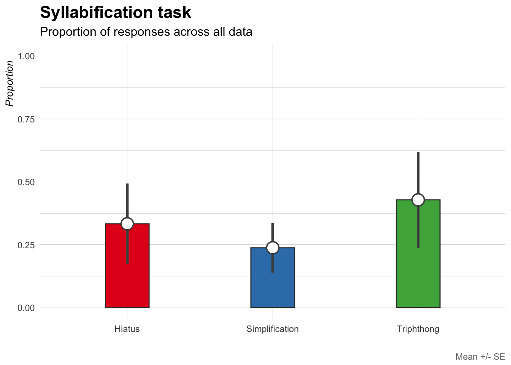
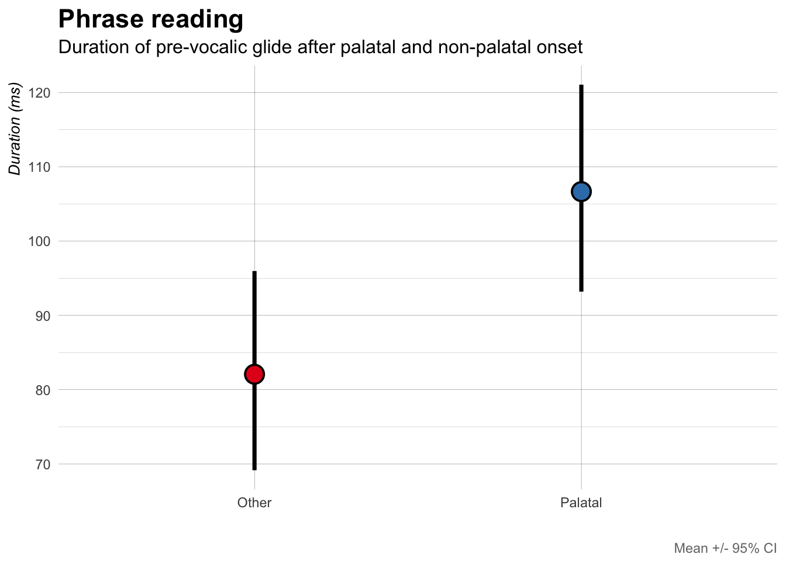
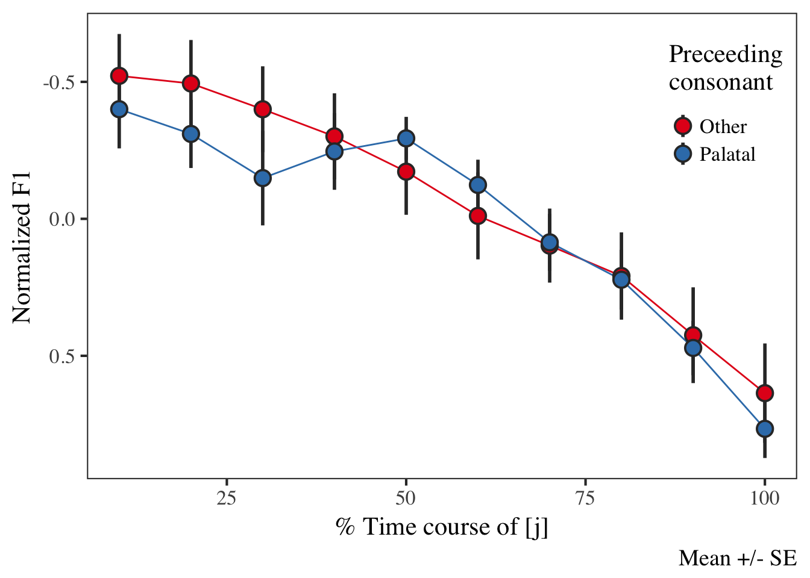
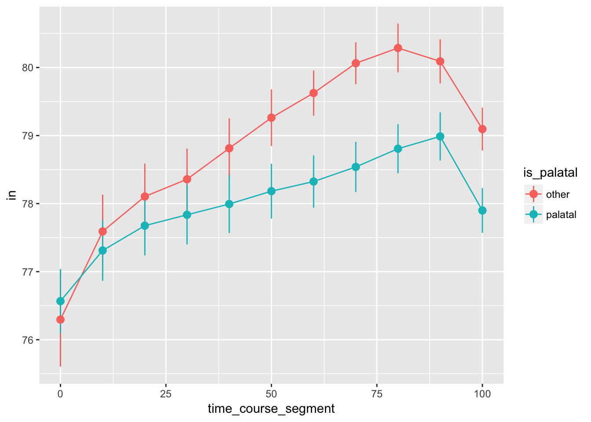
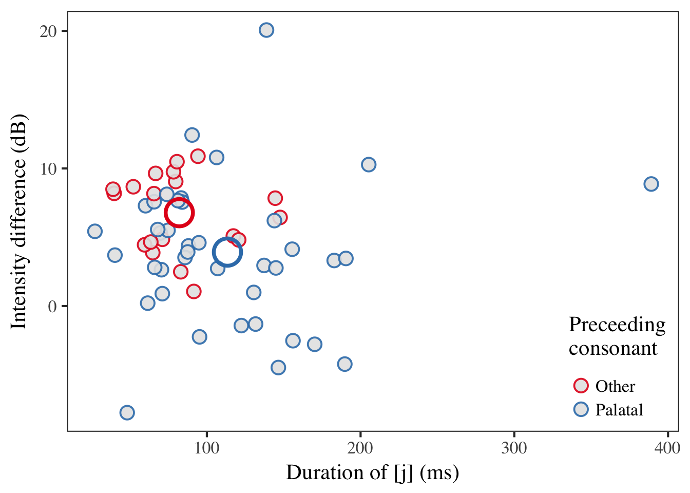

Syllabic affiliation of glides in chicano
=========================================

Last update: 2018-04-28
-----------------------

1.  [data](./data/)
2.  [praatScripts](./praatScripts/)
3.  [rScripts](./rScripts/)
4.  [sources](./sources/)

------------------------------------------------------------------------

Analyses
========

Syllabification task
--------------------

The following plots show results from the syllabification task. Four
syllable nonse words containing a CGVGC sequence in the penultimate
syllable were presented on a screen. Participants read the words out
loud, syllable by syllable. The plots show the overall distribution of
the responses, which have been classified in the following manner:

-   **tripthong**: the critical sequence was produced in a single
    syllable
-   **vowel + dipthong**: the critical sequence was produced as two
    syllables: CV + VGC (labeled as 'hiatus'), e.g. "lakapiaisto"
    \[la.ka.**pi**.'**ai̯s**.to\]
-   **simplification**: a segment was elided from the critical sequence,
    simplifying the critical syllable. The most common strategy was to
    drop the pre-vocalic glide, creating a sequence like
    \[la.ka.**pai̯s**.to\] instead of \[la.ka.'**pjai̯s**.to\]), but the
    post-vocalic glide was also dropped occasionally.

Figure 1 plots the proportion of responses accross all data (collapsing
across the pre-vocalic glide and onset). We observe that tripthongs were
produced in approximately 45% of the targets. A production containing a
hiatus made up roughly 30% of the data, followed by a simplification of
some sort (~25% of the time).

Figure 1: Responses in syllabification task.

If we combine `hiatus` and `simplification` (Figure 2), we see that they
make up approximately 60% of the data.

Figure 2: Responses in syllabification task combining
'hiatus/simplification'

Overall, the task provides evidence supporting the hypothesis that
pre-vocalic glides can be part of the onset in this variety of Spanish.

To consider:

-   What factors can explain the variation in response types?
-   Possibilities:
-   Frontness of glide. Is there a difference between \[j\] and \[w\]?
-   Preceeding consonant. The pre-vocalic glides in this task are
    preceeded by a stop (voiced and voiceless) or \[f\]

Carrier sentence task
---------------------

