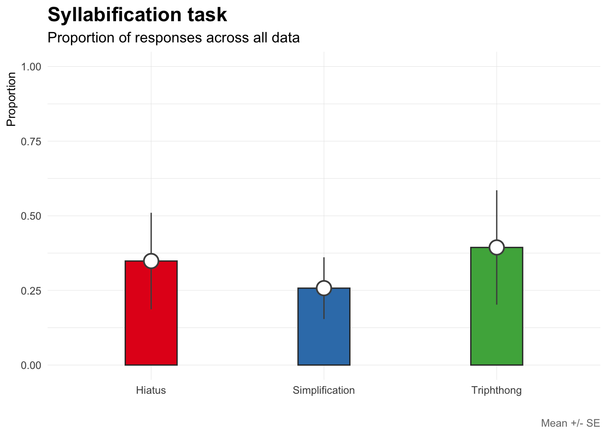
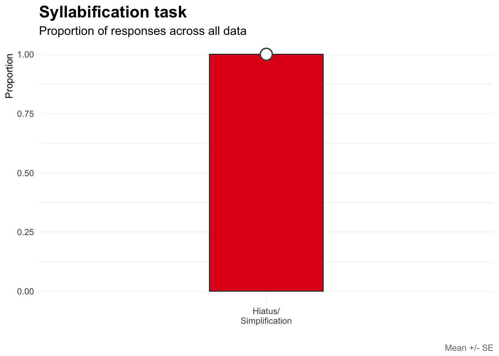
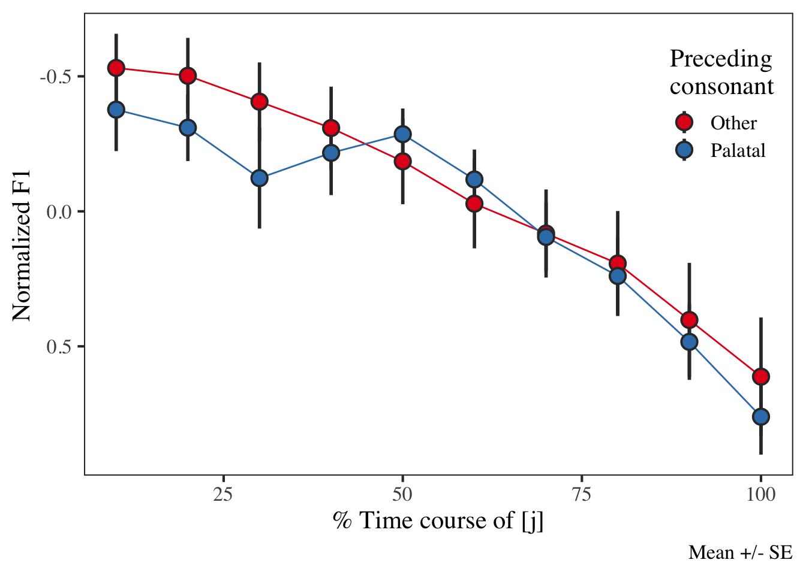

Syllabic affiliation of glides in chicano
=========================================

Last update: 2018-04-28
-----------------------

1.  [data](./data/)
2.  [praatScripts](./praatScripts/)
3.  [rScripts](./rScripts/)
4.  [sources](./sources/)

------------------------------------------------------------------------

Analyses
========

    ## Observations: 1,247
    ## Variables: 8
    ## $ participant   <chr> "p03", "p03", "p03", "p03", "p03", "p03", "p03",...
    ## $ exp           <chr> "carrier", "carrier", "carrier", "carrier", "car...
    ## $ task          <int> 1, 1, 1, 1, 1, 1, 1, 1, 1, 1, 1, 1, 1, 1, 1, 1, ...
    ## $ item          <chr> "chiaba", "chiaba", "costonhialo", "costonhialo"...
    ## $ status        <chr> "hit", "hit", "hit", "hit", "hit", "hit", "hit",...
    ## $ TextGridLabel <chr> "i", "a", "i", "a", "o", "i", "u", "a", "i", "a"...
    ## $ duration      <dbl> 60.13, 183.81, 61.53, 133.11, 146.21, 145.45, 76...
    ## $ sex           <chr> "m", "m", "m", "m", "m", "m", "m", "m", "m", "m"...
    ## Observations: 13,717
    ## Variables: 14
    ## $ participant         <chr> "p03", "p03", "p03", "p03", "p03", "p03", ...
    ## $ exp                 <chr> "carrier", "carrier", "carrier", "carrier"...
    ## $ task                <int> 1, 1, 1, 1, 1, 1, 1, 1, 1, 1, 1, 1, 1, 1, ...
    ## $ item                <chr> "chiaba", "chiaba", "chiaba", "chiaba", "c...
    ## $ status              <chr> "hit", "hit", "hit", "hit", "hit", "hit", ...
    ## $ TextGridLabel       <chr> "a", "a", "a", "a", "a", "a", "a", "a", "a...
    ## $ duration            <dbl> 183.81, 183.81, 183.81, 183.81, 183.81, 18...
    ## $ time_course_segment <int> 0, 10, 20, 30, 40, 50, 60, 70, 80, 90, 100...
    ## $ sex                 <chr> "m", "m", "m", "m", "m", "m", "m", "m", "m...
    ## $ f0                  <dbl> 117.51, 116.91, 116.21, 116.01, 116.01, 11...
    ## $ f1                  <dbl> 472.10, 545.10, 586.90, 631.48, 666.34, 69...
    ## $ f2                  <dbl> 2192.50, 1896.37, 1740.53, 1663.15, 1600.7...
    ## $ f3                  <dbl> 2804.07, 2823.23, 2784.17, 2763.05, 2701.6...
    ## $ `in`                <dbl> 80.46, 81.81, 82.42, 82.46, 82.08, 81.78, ...
    ## Observations: 84
    ## Variables: 12
    ## $ participant <chr> "p03", "p03", "p03", "p03", "p03", "p03", "p03", "...
    ## $ exp         <chr> "syllable", "syllable", "syllable", "syllable", "s...
    ## $ task        <int> 1, 1, 1, 1, 1, 1, 1, 1, 1, 1, 1, 1, 1, 1, 1, 1, 1,...
    ## $ item        <chr> "lakabiaisto", "lakabuaisto", "lakadiaisto", "laka...
    ## $ status      <chr> "hit", "hit", "hit", "hit", "hit", "hit", "hit", "...
    ## $ syll1Lab    <chr> "la", "la", "la", "la", "la", "la", "la", "la", "l...
    ## $ syll2Lab    <chr> "ka", "ka", "ka", "ka", "ka", "ka", "ka", "ka", "k...
    ## $ syll3Lab    <chr> "biais", "buais", "diais", "duais", "fiais", "fuai...
    ## $ syll4Lab    <chr> "to", "to", "to", "to", "to", "to", "to", "to", "t...
    ## $ syll5Lab    <chr> NA, NA, NA, NA, NA, NA, NA, NA, NA, NA, NA, NA, NA...
    ## $ labID       <chr> NA, NA, NA, NA, NA, NA, "[g]", "[w]", NA, NA, NA, ...
    ## $ response    <chr> "Tripthong", "Tripthong", "Tripthong", "Tripthong"...

Syllabification task
--------------------

The following plots show results from the syllabification task. Four
syllable nonse words containing a CGVGC sequence in the penultimate
syllable were presented on a screen. Participants read the words out
loud, syllable by syllable. The plots show the overall distribution of
the responses, which have been classified in the following manner:

-   **tripthong**: the critical sequence was produced in a single
    syllable
-   **vowel + dipthong**: the critical sequence was produced as two
    syllables: CV + VGC (labeled as 'hiatus'), e.g. "lakapiaisto"
    \[la.ka.**pi**.'**ai̯s**.to\]
-   **simplification**: a segment was elided from the critical sequence,
    simplifying the critical syllable. The most common strategy was to
    drop the pre-vocalic glide, creating a sequence like
    \[la.ka.**pai̯s**.to\] instead of \[la.ka.'**pjai̯s**.to\]), but the
    post-vocalic glide was also dropped occasionally.

Figure 1 plots the proportion of responses accross all data (collapsing
across the pre-vocalic glide and onset). We observe that tripthongs were
produced in approximately 45% of the targets. A production containing a
hiatus made up roughly 30% of the data, followed by a simplification of
some sort (~25% of the time).

Figure 1: Responses in syllabification task.

Carrier sentence task
---------------------

