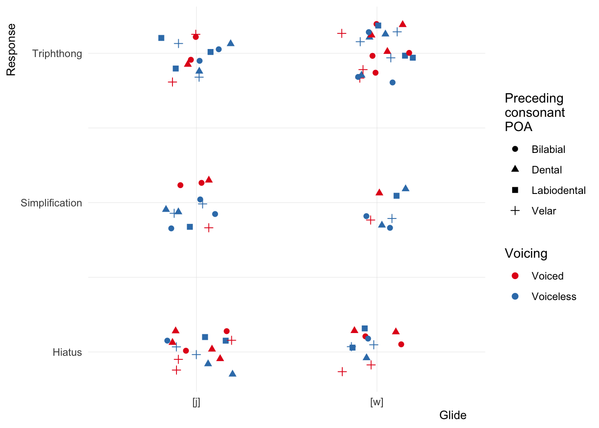
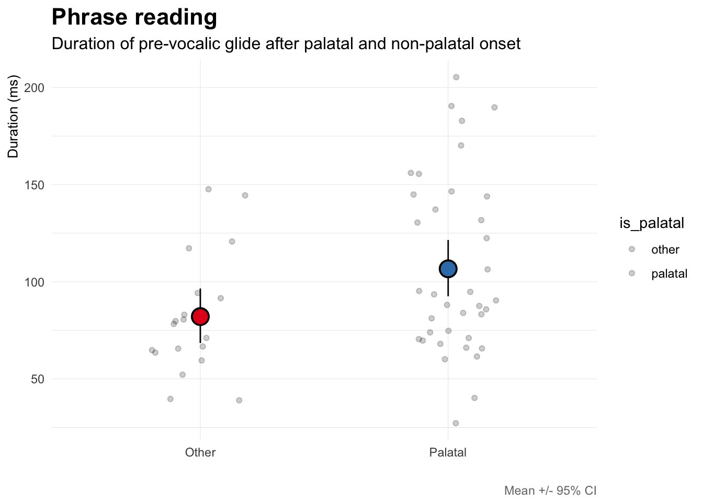
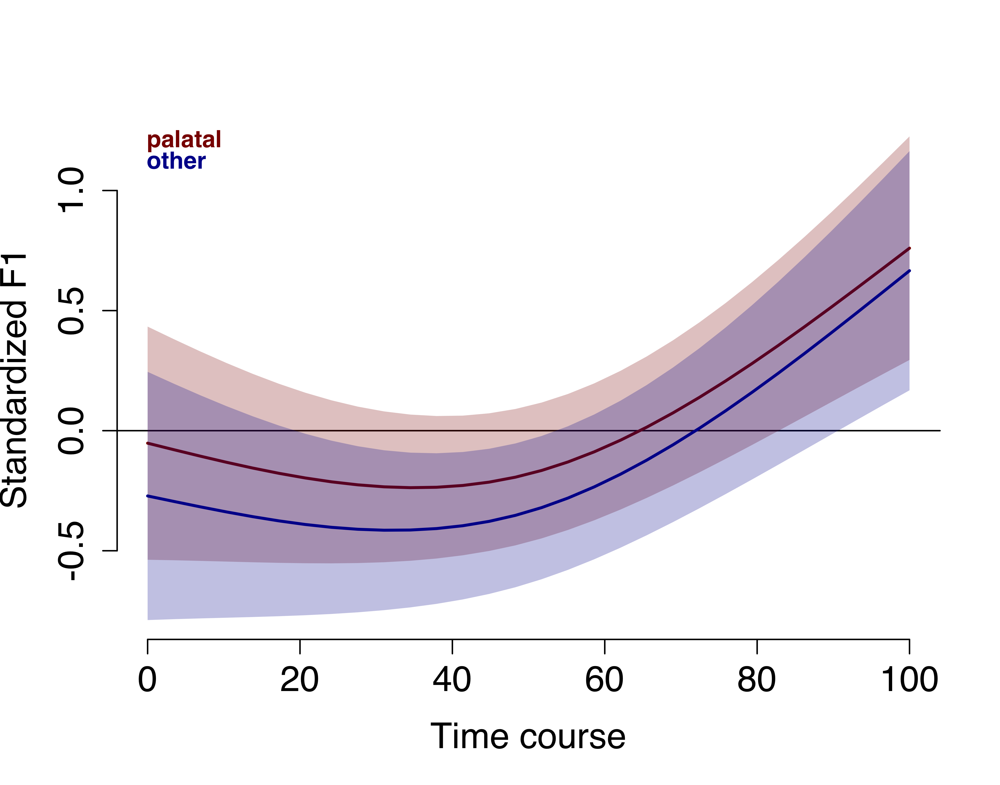
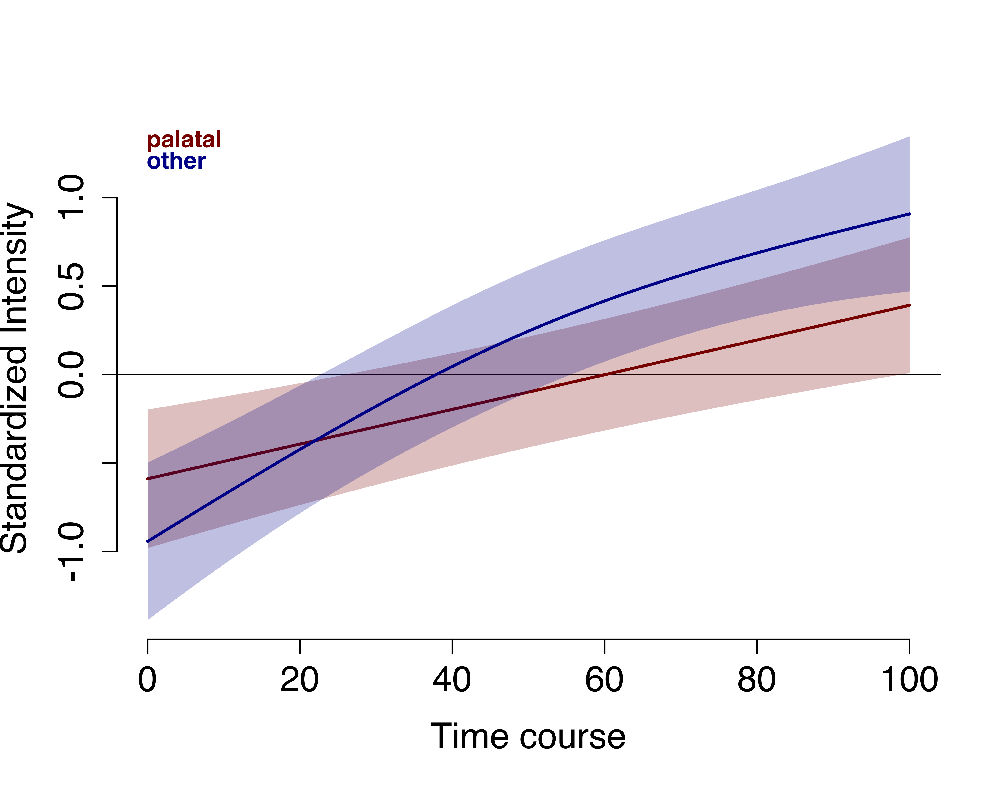
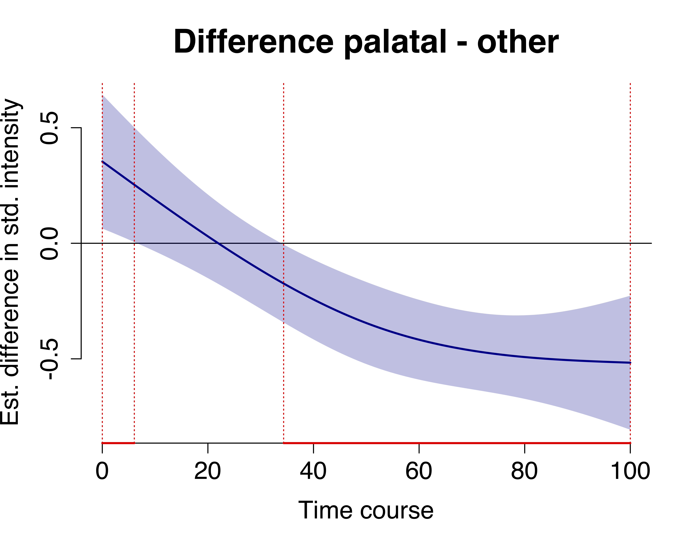

# Syllabic affiliation of glides in chicano

## Last update: 2023-12-01

1.  [data](./data/)
2.  [scripts](./scripts/)
3.  [sources](./sources/)

------------------------------------------------------------------------

Paso 1 (hecho): grabar gente silabificando.

Paso 2: Poner las grabaciones en línea para que otros raters den su
juicio (i.e., ¿esta persona ha dicho la ka pi aisto? - nativos (de
donde?) - cuantos participantes? - cuantas opciones? (mirar doc a ver si
hay tendencias) - que se nos olvida?

Paso 3: Reclutar más participantes para que hagan la tarea de
silabificación en línea y las opciones serían las respuestas más comunes
del piloto (paso 1) que han sido confirmadas por raters (paso 2). - ven
texto - escogen entre dos opciones - nativos (de donde?) (dos grupos?) -
cuantos participantes?

# Analyses

## Syllabification task

The following plots show results from the syllabification task. Four
syllable nonse words containing a CGVGC sequence in the penultimate
syllable were presented on a screen. Participants read the words out
loud, syllable by syllable. The plots show the overall distribution of
the responses, which have been classified in the following manner:

-   **tripthong**: the critical sequence was produced in a single
    syllable
-   **vowel + dipthong**: the critical sequence was produced as two
    syllables: CV + VGC (labeled as ‘hiatus’), e.g. “lakapiaisto”
    \[la.ka.**pi**.’**ai̯s**.to\]
-   **simplification**: a segment was elided from the critical sequence,
    simplifying the critical syllable. The most common strategy was to
    drop the pre-vocalic glide, creating a sequence like
    \[la.ka.**pai̯s**.to\] instead of \[la.ka.’**pjai̯s**.to\]), but the
    post-vocalic glide was also dropped occasionally.

Figure 1 plots the proportion of responses across all data (collapsing
across the pre-vocalic glide and onset). We observe that tripthongs were
produced in approximately 45% of the targets. A production containing a
hiatus made up roughly 30% of the data, followed by a simplification of
some sort (~25% of the time).

Figure 1: Responses in syllabification task.

If we combine `hiatus` and `simplification` (Figure 2), we see that they
make up approximately 60% of the data.

Figure 2: Responses in syllabification task combining
‘hiatus/simplification’.

Overall, the task provides evidence supporting the hypothesis that
pre-vocalic glides can be part of the onset in this variety of Spanish.

**To consider**:

-   What factors can explain the variation in response types?
-   Possibilities:
    -   Frontness of glide. Is there a difference between \[j\] and
        \[w\]?
    -   Preceding consonant. The pre-vocalic glides in this task are
        preceded by a stop (voiced and voiceless) or \[f\]. Is there is
        a difference in response strategies as a function of preceding
        consonant?
-   Figure 3 suggests that frontness and preceding consonant are not
    critical in determining response type.

Figure 3: Responses in syllabification task as a function of glide,
preceding consonant, and voicing.

**Statistical analysis**:

-   Multinomial mixed effects regression
-   Criterion: response (tripthong/hiatus/simplification)
-   Predictors: glide (\[j\]/\[w\]), consonant (\[b, d, g, p, t, k, f\])
-   Random effects:
    -   `(1 + glide + consonant | participant)`
    -   `(1 + glide + consonant | item)`
-   Another possibility is to combine hiatus/simplification and use
    standard logistic regression.

   

## Carrier sentence task

The following plots illustrate the results from the carrier sentence
task. These analyses test the hypothesis that pre-vocalic glides will be
disallowed if preceded by a palatal consonant. To test this, we measure
duration, F1, and intensity of the pre-vocalic glide in two
environments: after a palatal consonant and after any other consonant.
If pre-vocalic glides are blocked after palatals, we expect to observe
differences in overall duration. Figure 3 plots the duration data.

Figure 3: Duration as a function of preceding consonant.

We see a longer duration for glide segments following a palatal
consonant (contrary to the hypothesis). There are two possible
explanations (that I can think of). 1) The participants are able to
produce a glide in this context (at least in some cases) because the
preceding consonant is not palatal (i.e., ‘ch’ is surfacing as \[ʃ\] or
the fact that it is alveo-palatal is different enough to allow a glide
afterwards). 2) The participants are not producing a glide, but rather
are lengthening the onset.

We can examine the plausibility of (1) by looking at the formant
trajectory over the course of the segment. If the participants are able
to produce a glide in some contexts but not others we should see
differences in F1 as a function of the preceding consonant.

<figure>

<figcaption aria-hidden="true">gam-f1</figcaption>
</figure>

Again, the second possibility is that participants are lengthening the
palatal consonant (not producing a glide) because of the fact that they
cannot produce both. In other words, they might be trying to produce
something, but because the target is illicit, they resort to lengthening
the onset. If this is indeed what is happening, then we would expect the
intensity of the lengthened segment to be lower from that of a glide.
Why? Because more consonant-like productions have lower intensity than
more vowel-like productions. Thus we analyze the time course of
intensity in order to see how the two environments differ as they near
the following \[a\].

<figure>

<figcaption aria-hidden="true">gam-int</figcaption>
</figure>

<figure>

<figcaption aria-hidden="true">gam-int-dif</figcaption>
</figure>
